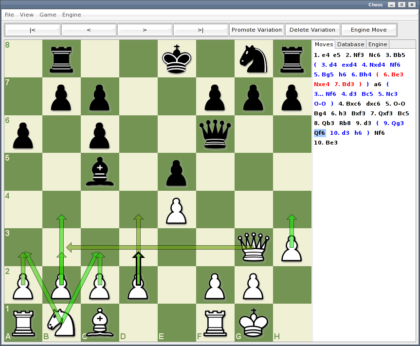

Chess
=====

A chess ui for analysing positions and games.

Features
--------

* PGN import/export with support for variatios and comments.
* FEN saving and loading.
* View opening databases with win/draw/loss percentages for each position.
* See top-10 engine evalutations for each position with color-coded overlay.
* Arrow overlay for moves played in each position.
* Position editor.
* Play against engine.
* Navigate through and edit multiple variations.

Installation
------------
* Replace lib/swt.jar with your platform specific library from: from http://www.eclipse.org/swt/.

* Set TOGA path in src/controller/MainController.java for engine support.

* Build with ant:

        ant jar
    
Usage
-----

    java -jar chess.jar [--fen initialPosition] [--pgn pgnFile] [--help]
